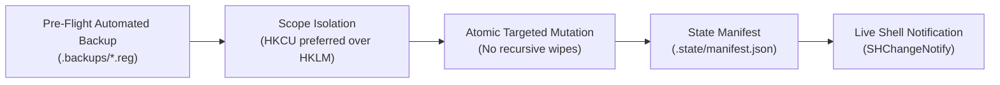

# Safety Standards & Emergency Recovery Guide

Modifying the Windows Registry and shell configuration requires strict discipline to prevent unintended file association breakage, Explorer instability, or data loss. This document details the defense-in-depth safety boundaries implemented across this repository and provides an emergency recovery guide.

---

## 1. Defense-in-Depth Safety Principles



### Principle 1: Automated Pre-Flight Registry Backups
Before any script modifies or creates a registry key, it performs an automated export of that key's current state:
- Uses Windows' native `reg.exe export "<KeyPath>" "<BackupFile>" /y`.
- Stored in the gitignored `.backups/` directory with a timestamped filename:
  - `.backups/YYYYMMDD_HHMMSS_<tweak-name>_<sanitized-key>.reg`
- **Zero-Dependency Guarantee**: The exported `.reg` file is completely standalone. Even if PowerShell is disabled, corrupted, or unavailable, you can restore your exact previous state by simply double-clicking the `.reg` file in Windows File Explorer.

### Principle 2: Preference for User-Scope (`HKCU`)
- Wherever Windows permits, tweaks are applied to `HKEY_CURRENT_USER\Software\...` rather than machine-wide hives (`HKEY_LOCAL_MACHINE` or `HKEY_CLASSES_ROOT`).
- **Benefits**:
  - Requires **zero administrative elevation**.
  - Confined strictly to the active user profile—cannot break system stability or other user accounts on shared PCs.
  - HKLM / HKCR is reserved strictly for features where Windows architecture mandates system-wide registration (such as global `ShellNew` ProgIDs).

### Principle 3: Non-Destructive Scoping
- Scripts and `.reg` files must **never** execute recursive deletes (`Remove-Item -Recurse` or `[-HKEY_...]`) on shared parent keys (e.g., `HKCR\.md` or `HKCU\...\Explorer\Advanced`).
- Only the specific leaf keys or values added by the tweak (e.g., `HKCR\.md\ShellNew`) may be removed.
- Pre-existing values (like third-party default editor assignments) are preserved and restored during rollback.

### Principle 4: State Manifest Tracking
All script-applied tweaks are registered in `.state/manifest.json`:
- Records the tweak ID, name, ISO 8601 timestamp, list of modified keys, and paths to pre-flight backup files.
- Ensures you have full visibility into every change made to your system.

---

## 2. Emergency Recovery Guide

If a tweak produces unexpected behavior or you wish to undo all changes, choose one of the recovery methods below.

### Method 1: Using the Tweak's `Revert.ps1` or `revert.reg`
Every tweak in this repository includes a dedicated uninstaller following the **Twin Contract**:
- **Via Registry**: Double-click `revert.reg` inside the tweak's folder.
- **Via PowerShell**: Run:
  ```powershell
  powershell -ExecutionPolicy Bypass -File .\context-menu\new-markdown-document\Revert.ps1
  ```

### Method 2: Restoring Directly from `.backups/` (Instant 1-Click Undo)
If you need to restore the exact state captured immediately prior to applying a tweak:
1. Open the `.backups/` folder in File Explorer.
2. Locate the `.reg` file matching your tweak name and timestamp.
3. Double-click the file and confirm the UAC prompt to merge the original values back into the registry.
4. Restart File Explorer (or run `Invoke-ShellRefresh` / log out and back in) to apply the restored state.

### Method 3: Command-Line Registry Import
From an elevated Command Prompt or PowerShell:
```cmd
reg import .backups\YYYYMMDD_HHMMSS_<tweak>_<key>.reg
```

---

## 3. Developer Safety Checklist for New Tweaks

When contributing a new tweak, ensure:
1. [ ] The tweak is strictly within File Explorer scope (see [TAXONOMY.md](./TAXONOMY.md)).
2. [ ] Both `apply.reg` and `revert.reg` are tested and verified.
3. [ ] `Apply.ps1` incorporates pre-flight backup (`Backup-RegistryKey`) and state registration (`Register-TweakState`).
4. [ ] `Revert.ps1` removes only targeted subkeys and calls `Unregister-TweakState`.
5. [ ] Both scripts call `Invoke-ShellRefresh` (`SHChangeNotify`) instead of forcing unexpected system reboots.
